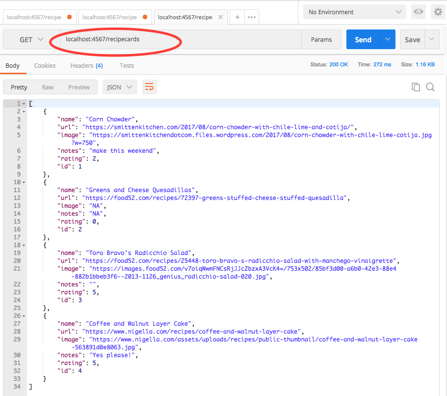
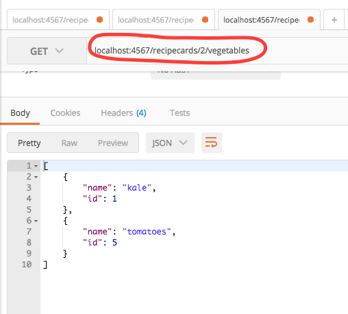

# Recipe Box API 

##### Epicodus Section: Java Week4 : Advanced Java Topics

### By Jessica Sheridan

## Table of Contents

- [Description](#description)
- [Test Plan](#test-plan)
    - [httpie](#httpie)
- [API Documentation](#api documentation)
    - [Root](#root)
    - [Recipe Cards](#recipe cards)
    - [Vegetable](#vegetable)
    - [Meal](#meal)
- [Setup](#setup)
- [Support](#support)
- [License](#license)
- [Links](#links)

## Description

The Recipe Box API backend server with Spark is ready for a client app to keep track of all your personal favorite 
recipes from around the internet. The most powerful Recipe Box is one that allows for custom tagging for searching 
to find just the right recipe in a pinch. Current tag categories include Vegetables (search your database for recipes with this week's CSA delivery!) and Meals (looking for a brunch ideas?). 

	* Database is populated for example in main.
	* Future Tags will be included in next release.

## Test Plan 

####Complete Dao Coverage
####Verification: Run: Sql2oRecipeCardDaoTest, and Sql2oTagDaoTest

| Behavior      | Input | Output |
| ------------- | ------------- | ------------- |
| addingRecipeSetsId | recipeCard | 1 |
| existingRecipeCardsCanBeFoundById | 1 | recipeCard|
| getAll_allRecipeCardsAreFound | recipeCard1,recipeCard2 | 2|
| update_correctlyUpdates | recipeCard.getName | newName|
| deleteById | recipeCard | 0|
| ------------- | ------------- | ------------- |
| addTagtoRecipeCard | |  |
| getAllRecipeCardsForATag | |  |
| getAllTagsForARecipeCard | |  |
| ------------- | ------------- | ------------- |

### httpie 

## API Documentation
This documentation will introduce the API endpoints that you can use HTTP requests to retrieve data (and
post data).

### Root
####The Root url provides information on all available resources within the API currently:

### Recipe Cards
#### Endpoints:
	#####[create]
	*localhost:4567/recipecards/new 					--Add new recipeCard
	*localhost:4567/recipecards/:recipeCardId/vegetables/:vegetableId/new	--Add specific vegetable tag to recipeCard
	*localhost:4567/recipecards/:recipeCardId/meals/:mealId/new		--Add specific meal tag to recipeCard

	#####[retrieve]
	*localhost:4567/recipecards				-- get all recipeCard resources
	*localhost:4567/recipecards/:id				--specific recipeCard resource
	*localhost:4567/recipecards/:recipeCardId/vegetables	-- get All vegetable tags for a recipeCard
	*localhost:4567/recipecards/:recipeCardId/meal		-- get All meal tags for a recipeCard

#### Example:

#### Attributes:
	| Attribute | datatype | desc    |
	| name      | String | Name of recipe |
	| url      | String | location of recipe on the internet|
	| image      | String | location of an image of the recipe|
	| notes      | String | personal spot to add a note about the recipe| 
	| rating      | int | how much did you like it | 
	| id      | int | recipe number | 

### Vegetable 
#### Endpoints:
	*localhost:4567/vegetables	--get all vegetable resources
	*localhost:4567/vegetables/new	--create new vegetable tag
#### Example:

#### Attributes:
	| Attribute | datatype | desc    |
	| name      | String | Name of tag |
	| id      | int | tag id|

### Meal 
####  Endpoints:
	*localhost:4567/meals		--get all meal resources
	*localhost:4567/meals/new	--create new meal tag
####  Example:
####  Attributes:
	| Attribute | datatype | desc    |
	| name      | String | Name of tag |
	| id      | int | tag id|

## Setup
git clone https://github.com/jessicakenney/recipe-box.git
bring up url: localhost:4567

## Support 
email with any questions: jessicakenney@yahoo.com,

## Known Issues/Bugs

## Technologies Used
Java,Handlebars,Postman

